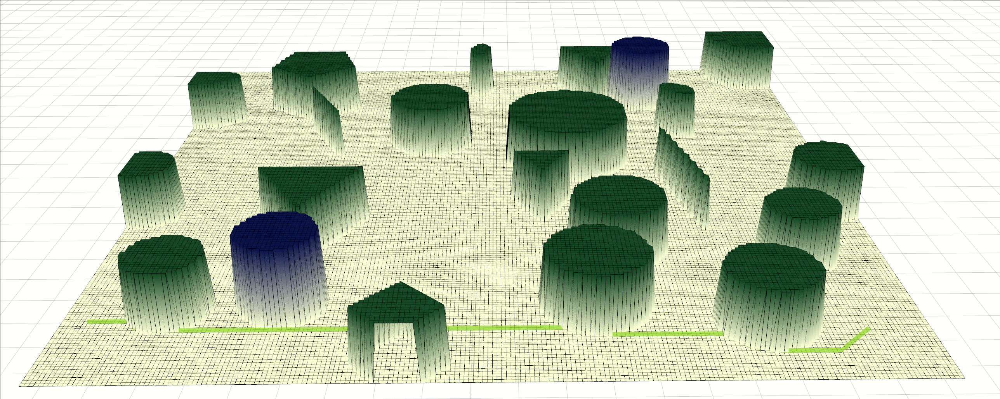

# README.md

<div align="center" style="margin: 20px 0;">
  
</div>

## 一. 项目作用
根据库map_generator生成的grid_map，进行全局路径搜索，根据全局路径搜索的结果，生成凸包作为飞行走廊，根据飞行走廊的结果，作为MPC的约束，优化后面的MPC的轨迹


## 二. 环境安装
> 此设置已在 **Ubuntu 20.04** 和 **ros1 noetic** 上通过测试。

### 2.1 克隆带有子模块的仓库
```bash
mkdir -p traj_optimization_ws/src && cd traj_optimization_ws
git clone git@github.com:Tipriest/trajectory_optimization.git ./src/trajectory_optimization
cd ./src/trajectory_optimization && git submodule update --init --recursive
cd .. && git clone git@github.com:Tipriest/map_generator.git

sudo apt install ros-noetic-grid-map
```

### 2.2 编译
```bash
catkin build
```


## 三. 仿真环境使用
```bash
# 打开仿真地图
roslaunch map_generator map_generator.launch
roslaunch trajectory_optimization optimize_visual.launch

```
